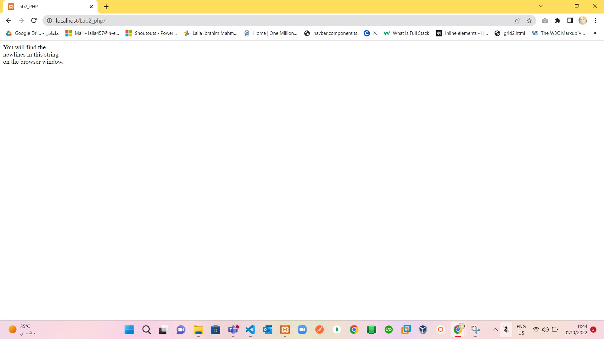
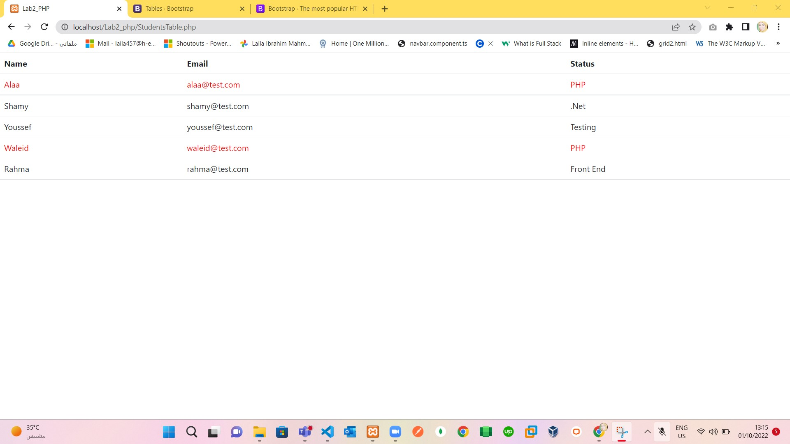

# Part1:
>  Search for how to make \n work in browser.

> Solve Part1:
  By using the PHP nl2br() function which inserts HTML line breaks before all newlines in a string. As in:
  

# Part2
>  Search for 3 built-in function of a string.

> Solve Part 2: 
 1. `addcslashes()` Returns a string with backslashes in front of the specified characters.
 2. `addslashes()`	Returns a string with backslashes in front of predefined characters.
 3. `bin2hex()`	Converts a string of ASCII characters to hexadecimal values.
 4. `chop()`	Removes whitespace or other characters from the right end of a string.
 5. `chr()`	Returns a character from a specified ASCII value.
> as in: 
 

# Part3
> Write a PHP script to get the sum and avg of an indexed array
 1. with value = 45 in index =1
 2. with value = 12 in index =0
 3. with value = 25 in index =3
 4. with value = 10 in index =2
 after that sort it in a reverse order (highest to lowest).

 > Solve Part 3: 
 1. `array_reverse()` — Return an array with elements in reverse order.
 2. `array_sum()` - Return sum of Array values 
 3. `array_count()` - to count length of array
 
# Part4
>  Write a PHP script to sort the following associative array :
 array("Sara"=>31,"John"=>41,"Walaa"=>39,"Ramy"=>40) in
 1. ascending order sort by value by `asort()`
 2. ascending order sort by Key by `ksort()`
 3. descending order sorting by Value by `arsort()`
 4. descending order sorting by Key  by `krsort()`

# Part5
> Display the following array in an HTML table with Name, Email and Status table headers.
 Specify PHP status with red color.
    $students = [
        ['name' => 'Alaa', 'email' => 'alaa@test.com', 'status' => 'PHP'],
        ['name' => 'Shamy', 'email' => 'shamy@test.com', 'status' => '.Net'],
        ['name' => 'Youssef', 'email' => 'youssef@test.com', 'status' => 'Testing'],
        ['name' => 'Waleid', 'email' => 'waleid@test.com', 'status' => 'PHP'],
        ['name' => 'Rahma', 'email' => 'rahma@test.com', 'status' => 'Front End'],
    ];

> Solve as in : 
 